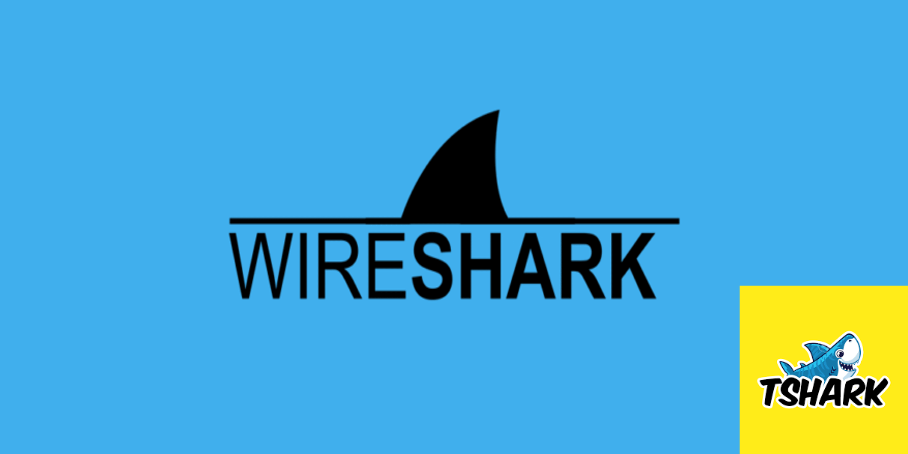

# 🛡️ **Analyse de Trames avec Wireshark**

[](https://www.wireshark.org/) [](https://en.wikipedia.org/wiki/Internet_Control_Message_Protocol) [](https://en.wikipedia.org/wiki/Transmission_Control_Protocol)



---

## 📄 **Description**

Ce dépôt contient des ressources dédiées à l'analyse de trames réseau avec **Wireshark**. Vous y trouverez des captures de paquets au format `.pcap`, des guides d'analyse, et des exercices pratiques pour comprendre les principaux protocoles réseau (ICMP, TCP, UDP, etc.).

Cet atelier est conçu pour vous aider à développer des compétences en inspection et en diagnostic de trames réseau.

---

## 📚 **Qu'est-ce que Wireshark ?**

**Wireshark** est un analyseur de protocole réseau open-source qui permet de capturer et d'inspecter les paquets circulant sur un réseau en temps réel. C'est un outil puissant pour :

- **Diagnostiquer des problèmes réseau**.
- **Analyser les protocoles réseau**.
- **Identifier des vulnérabilités de sécurité**.
- **Former et éduquer sur les communications réseau**.

### 🔗 **Fonctionnalités Principales de Wireshark**

- **Capture de paquets en temps réel** depuis divers types d'interfaces.
- **Filtrage avancé** pour cibler des paquets spécifiques.
- **Analyse approfondie** des protocoles réseau (Ethernet, IP, TCP, UDP, ICMP, etc.).
- **Visualisation des flux de trafic** pour comprendre les communications.
- **Support des fichiers de capture** au format `.pcap` et `.pcapng`.
- **Statistiques et graphiques** pour une vue d'ensemble du trafic.

---

## 📖 **Contenu du Dépôt**

- **`documentation/`** : Guides et tutoriels d'analyse de trames.
  - `Bloc1_sem1-atelier_05_wireshark_Candice_Vialette.docx` : Document de référence pour l'atelier.

- **`image/`** : Images et ressources visuelles pour l'atelier.
  - `background.png` : Image de fond pour la présentation.

- **`trames/`** : Captures de paquets pour analyse avec Wireshark.
  - `20241213_ICMP_172.31.1.67_1.pcap` : Exemple de capture ICMP.
  - `Trame_avancée.txt` : Description d'une trame complexe.

- **`README.md`** : Guide du dépôt.

---

## ⚙️ **Prérequis**

- **Wireshark** installé sur votre machine.
  - [Télécharger Wireshark](https://www.wireshark.org/download.html)

- Connaissances de base sur les protocoles réseau : 
  - **ICMP**, **TCP**, **UDP**.

---

## 🚀 **Mise en Œuvre**

### 1. **Cloner le Dépôt**

```bash
git clone https://github.com/votre_nom_utilisateur/wireshark-analyse-trames.git
cd wireshark-analyse-trames
```

### 2. **Parcourir la Documentation**

Consultez le dossier `documentation/` pour des guides d'analyse détaillés.

### 3. **Ouvrir les Captures de Paquets**

1. Lancez **Wireshark**.
2. Importez les fichiers `.pcap` disponibles dans le dossier `trames/`.
3. Utilisez les filtres pour inspecter les paquets :
   ```
   icmp
   tcp
   udp
   ```

---

## 👉 **Exemples de Filtres Wireshark**

- **Filtrer les paquets ICMP** :
  ```
  icmp
  ```
- **Filtrer les paquets TCP sur le port 80 (HTTP)** :
  ```
  tcp.port == 80
  ```
- **Filtrer les paquets UDP** :
  ```
  udp
  ```

---

## 💡 **Bonnes Pratiques**

- **Sauvegardez vos filtres favoris** pour gagner du temps.
- **Utilisez des couleurs de filtrage** pour distinguer les différents types de paquets.
- **Prenez des notes** sur vos observations pendant l'analyse.

---

## 📚 **Ressources Utiles**

- [Documentation Officielle Wireshark](https://www.wireshark.org/docs/)
- [Liste des Filtres d'Affichage Wireshark](https://www.wireshark.org/docs/dfref/)
- [Tutoriels Wireshark](https://www.wireshark.org/docs/wsug_html_chunked/)

---

## 🌍 **Licence**

Ce projet est sous licence MIT. Consultez le fichier [LICENSE](LICENSE) pour plus d'informations.

---

### 🗓 **Date de Création**

Décembre 2024
